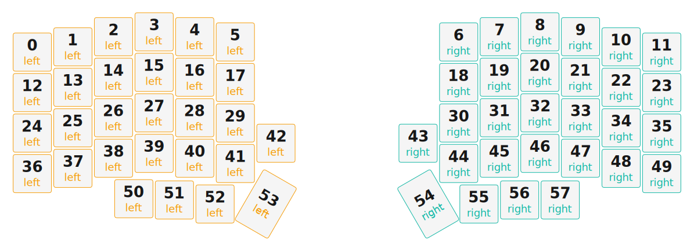

# ZMK Configuration for Lilly58

*Generated by Shield Wizard for ZMK*



Download compiled firmware from the Actions tab. <https://zmk.dev/docs/user-setup#installing-the-firmware>

Edit your keymap <https://zmk.dev/docs/keymaps>.
User keymap is located at [`config/lilly58.keymap`](config/lilly58.keymap).

-----

<details>
<summary>
Shield Wizard Debug Information
</summary>

In case of broken configuration, here is the Shield Wizard internal data used to generate this configuration:

Commit: 5840d41ac0915092c8fe45da617ffb4bb91e1b97

```json
{"name":"Lilly58","shield":"lilly58","dongle":false,"modules":[],"layout":[{"id":"01KKSE18XASM8M09RS0N5V5XDQ","part":0,"row":0,"col":0,"w":1,"h":1,"x":0,"y":0.5,"r":0,"rx":0,"ry":0},{"id":"01KKSE18XAECNQRWW9SENXW7N8","part":0,"row":0,"col":1,"w":1,"h":1,"x":1,"y":0.37,"r":0,"rx":0,"ry":0},{"id":"01KKSE18XAS161HXTRY8BRXKXR","part":0,"row":0,"col":2,"w":1,"h":1,"x":2,"y":0.12,"r":0,"rx":0,"ry":0},{"id":"01KKSE18XA9ZC566RB6FQQAEKX","part":0,"row":0,"col":3,"w":1,"h":1,"x":3,"y":0,"r":0,"rx":0,"ry":0},{"id":"01KKSE18XAARY2G5F76ACBV8YS","part":0,"row":0,"col":4,"w":1,"h":1,"x":4,"y":0.12,"r":0,"rx":0,"ry":0},{"id":"01KKSE18XAHSXTXGX9PJAZGE4K","part":0,"row":0,"col":5,"w":1,"h":1,"x":5,"y":0.25,"r":0,"rx":0,"ry":0},{"id":"01KKSE18XAYAC225TVNEBXCAM9","part":1,"row":0,"col":8,"w":1,"h":1,"x":10.5,"y":0.25,"r":0,"rx":0,"ry":0},{"id":"01KKSE18XA60HQW98QVB1ZB93G","part":1,"row":0,"col":9,"w":1,"h":1,"x":11.5,"y":0.12,"r":0,"rx":0,"ry":0},{"id":"01KKSE18XATCC6NYSF8EC78ZGJ","part":1,"row":0,"col":10,"w":1,"h":1,"x":12.5,"y":0,"r":0,"rx":0,"ry":0},{"id":"01KKSE18XAR21G5GDDXQWWGRBC","part":1,"row":0,"col":11,"w":1,"h":1,"x":13.5,"y":0.12,"r":0,"rx":0,"ry":0},{"id":"01KKSE18XA28SY0N8NCYBWD8E7","part":1,"row":0,"col":12,"w":1,"h":1,"x":14.5,"y":0.37,"r":0,"rx":0,"ry":0},{"id":"01KKSE18XAVTMTBHVVYATJHVTC","part":1,"row":0,"col":13,"w":1,"h":1,"x":15.5,"y":0.5,"r":0,"rx":0,"ry":0},{"id":"01KKSE18XADCNHHPW6ECESTQ32","part":0,"row":1,"col":0,"w":1,"h":1,"x":0,"y":1.5,"r":0,"rx":0,"ry":0},{"id":"01KKSE18XASA77QZPVAT0J3T74","part":0,"row":1,"col":1,"w":1,"h":1,"x":1,"y":1.37,"r":0,"rx":0,"ry":0},{"id":"01KKSE18XA2FK7462YGKY72JWT","part":0,"row":1,"col":2,"w":1,"h":1,"x":2,"y":1.12,"r":0,"rx":0,"ry":0},{"id":"01KKSE18XADA3VKD642HH6MNBN","part":0,"row":1,"col":3,"w":1,"h":1,"x":3,"y":1,"r":0,"rx":0,"ry":0},{"id":"01KKSE18XA6YNJFZK1REE9YJJV","part":0,"row":1,"col":4,"w":1,"h":1,"x":4,"y":1.12,"r":0,"rx":0,"ry":0},{"id":"01KKSE18XA3KS5VBBKY62HGRSX","part":0,"row":1,"col":5,"w":1,"h":1,"x":5,"y":1.25,"r":0,"rx":0,"ry":0},{"id":"01KKSE18XAH2HPHFGWHDKREETW","part":1,"row":1,"col":8,"w":1,"h":1,"x":10.5,"y":1.25,"r":0,"rx":0,"ry":0},{"id":"01KKSE18XAT4F85ZPEH5F6G5HN","part":1,"row":1,"col":9,"w":1,"h":1,"x":11.5,"y":1.12,"r":0,"rx":0,"ry":0},{"id":"01KKSE18XAT43NAQBDG1KQ6SXV","part":1,"row":1,"col":10,"w":1,"h":1,"x":12.5,"y":1,"r":0,"rx":0,"ry":0},{"id":"01KKSE18XA4CGNH832KV3HFZXV","part":1,"row":1,"col":11,"w":1,"h":1,"x":13.5,"y":1.12,"r":0,"rx":0,"ry":0},{"id":"01KKSE18XAKSVQ04EM7FPHTAFB","part":1,"row":1,"col":12,"w":1,"h":1,"x":14.5,"y":1.37,"r":0,"rx":0,"ry":0},{"id":"01KKSE18XA2D1MQ11WPS6XPJ9V","part":1,"row":1,"col":13,"w":1,"h":1,"x":15.5,"y":1.5,"r":0,"rx":0,"ry":0},{"id":"01KKSE18XAR0HCT429MGER7YQ4","part":0,"row":2,"col":0,"w":1,"h":1,"x":0,"y":2.5,"r":0,"rx":0,"ry":0},{"id":"01KKSE18XAQGKTJYGZZM1C9JXS","part":0,"row":2,"col":1,"w":1,"h":1,"x":1,"y":2.37,"r":0,"rx":0,"ry":0},{"id":"01KKSE18XAD2WCA9M55AQT8QS0","part":0,"row":2,"col":2,"w":1,"h":1,"x":2,"y":2.12,"r":0,"rx":0,"ry":0},{"id":"01KKSE18XAA39ZA9PSJF0CSF58","part":0,"row":2,"col":3,"w":1,"h":1,"x":3,"y":2,"r":0,"rx":0,"ry":0},{"id":"01KKSE18XA2R4P7WMT3H5WHKNR","part":0,"row":2,"col":4,"w":1,"h":1,"x":4,"y":2.12,"r":0,"rx":0,"ry":0},{"id":"01KKSE18XACM9CNACJYJ3CG2C5","part":0,"row":2,"col":5,"w":1,"h":1,"x":5,"y":2.25,"r":0,"rx":0,"ry":0},{"id":"01KKSE18XAW2RC7FN14P6MG051","part":1,"row":2,"col":8,"w":1,"h":1,"x":10.5,"y":2.25,"r":0,"rx":0,"ry":0},{"id":"01KKSE18XATFZ1J8HS08525QRF","part":1,"row":2,"col":9,"w":1,"h":1,"x":11.5,"y":2.12,"r":0,"rx":0,"ry":0},{"id":"01KKSE18XAAJ3CSKNHFT7A7ES5","part":1,"row":2,"col":10,"w":1,"h":1,"x":12.5,"y":2,"r":0,"rx":0,"ry":0},{"id":"01KKSE18XARY32KZW93J7N7KQP","part":1,"row":2,"col":11,"w":1,"h":1,"x":13.5,"y":2.12,"r":0,"rx":0,"ry":0},{"id":"01KKSE18XA9CGQYAEZCWSZQ4D0","part":1,"row":2,"col":12,"w":1,"h":1,"x":14.5,"y":2.37,"r":0,"rx":0,"ry":0},{"id":"01KKSE18XADX6AZ2G2KKSQPMBW","part":1,"row":2,"col":13,"w":1,"h":1,"x":15.5,"y":2.5,"r":0,"rx":0,"ry":0},{"id":"01KKSE18XA2TZAK1F8687WC74A","part":0,"row":3,"col":0,"w":1,"h":1,"x":0,"y":3.5,"r":0,"rx":0,"ry":0},{"id":"01KKSE18XA3P23RBMDKK7DJ2XZ","part":0,"row":3,"col":1,"w":1,"h":1,"x":1,"y":3.37,"r":0,"rx":0,"ry":0},{"id":"01KKSE18XACYH8KZMKF5EB07AP","part":0,"row":3,"col":2,"w":1,"h":1,"x":2,"y":3.12,"r":0,"rx":0,"ry":0},{"id":"01KKSE18XA41SAGMHXNW7MTD9J","part":0,"row":3,"col":3,"w":1,"h":1,"x":3,"y":3,"r":0,"rx":0,"ry":0},{"id":"01KKSE18XA6BWPK4PHY1X9CXZG","part":0,"row":3,"col":4,"w":1,"h":1,"x":4,"y":3.12,"r":0,"rx":0,"ry":0},{"id":"01KKSE18XA1ZNWPW5V0TQW5THN","part":0,"row":3,"col":5,"w":1,"h":1,"x":5,"y":3.25,"r":0,"rx":0,"ry":0},{"id":"01KKSE18XASCP9JHY16JJYC2KA","part":0,"row":3,"col":6,"w":1,"h":1,"x":6,"y":2.75,"r":0,"rx":0,"ry":0},{"id":"01KKSE18XAGS8DS9K62AGANS68","part":1,"row":3,"col":7,"w":1,"h":1,"x":9.5,"y":2.75,"r":0,"rx":0,"ry":0},{"id":"01KKSE18XAW6VS3DDANBSK51YB","part":1,"row":3,"col":8,"w":1,"h":1,"x":10.5,"y":3.25,"r":0,"rx":0,"ry":0},{"id":"01KKSE18XAJYJ4YY1K2TDRZ0HF","part":1,"row":3,"col":9,"w":1,"h":1,"x":11.5,"y":3.12,"r":0,"rx":0,"ry":0},{"id":"01KKSE18XAB225V3SZGD187BJ9","part":1,"row":3,"col":10,"w":1,"h":1,"x":12.5,"y":3,"r":0,"rx":0,"ry":0},{"id":"01KKSE18XA24PY7EQP46XZ7T3C","part":1,"row":3,"col":11,"w":1,"h":1,"x":13.5,"y":3.12,"r":0,"rx":0,"ry":0},{"id":"01KKSE18XABXQR79KBDTRADC96","part":1,"row":3,"col":12,"w":1,"h":1,"x":14.5,"y":3.37,"r":0,"rx":0,"ry":0},{"id":"01KKSE18XAQ8YS5RPAPEBZW9BH","part":1,"row":3,"col":13,"w":1,"h":1,"x":15.5,"y":3.5,"r":0,"rx":0,"ry":0},{"id":"01KKSE18XAKPXFNEMZKWBHJA1D","part":0,"row":4,"col":3,"w":1,"h":1,"x":2.5,"y":4.12,"r":0,"rx":0,"ry":0},{"id":"01KKSE18XAQQ3KN9K6S7GFJ9RP","part":0,"row":4,"col":4,"w":1,"h":1,"x":3.5,"y":4.15,"r":0,"rx":0,"ry":0},{"id":"01KKSE18XAKCRCAZG9XVGA2SDM","part":0,"row":4,"col":5,"w":1,"h":1,"x":4.5,"y":4.25,"r":0,"rx":0,"ry":0},{"id":"01KKSE18XAX94H8N34KB81A6K8","part":0,"row":4,"col":6,"w":1,"h":1.5,"x":5.75,"y":4,"r":30,"rx":6.25,"ry":4.75},{"id":"01KKSE18XAAVBVT9QFWE4XDD8S","part":1,"row":4,"col":7,"w":1,"h":1.5,"x":9.75,"y":4,"r":-30,"rx":10.25,"ry":4.75},{"id":"01KKSE18XAZ150B8RC6286Z56C","part":1,"row":4,"col":8,"w":1,"h":1,"x":11,"y":4.25,"r":0,"rx":0,"ry":0},{"id":"01KKSE18XAGMPVD4MP18RV5E9P","part":1,"row":4,"col":9,"w":1,"h":1,"x":12,"y":4.15,"r":0,"rx":0,"ry":0},{"id":"01KKSE18XA7P83D69K0ZGK8577","part":1,"row":4,"col":10,"w":1,"h":1,"x":13,"y":4.15,"r":0,"rx":0,"ry":0}],"parts":[{"name":"left","controller":"nice_nano_v2","wiring":"matrix_diode","pins":{"d19":"output","d18":"output","d15":"output","d14":"output","d16":"output","d10":"output","d5":"input","d6":"input","d7":"input","d9":"input","d8":"input"},"keys":{"01KKSE18XASM8M09RS0N5V5XDQ":{"input":"d5","output":"d19"},"01KKSE18XADCNHHPW6ECESTQ32":{"input":"d6","output":"d19"},"01KKSE18XAR0HCT429MGER7YQ4":{"input":"d7","output":"d19"},"01KKSE18XA2TZAK1F8687WC74A":{"input":"d8","output":"d19"},"01KKSE18XAECNQRWW9SENXW7N8":{"input":"d5","output":"d18"},"01KKSE18XASA77QZPVAT0J3T74":{"input":"d6","output":"d18"},"01KKSE18XAQGKTJYGZZM1C9JXS":{"input":"d7","output":"d18"},"01KKSE18XA3P23RBMDKK7DJ2XZ":{"input":"d8","output":"d18"},"01KKSE18XAKPXFNEMZKWBHJA1D":{"input":"d9","output":"d18"},"01KKSE18XAS161HXTRY8BRXKXR":{"input":"d5","output":"d15"},"01KKSE18XA2FK7462YGKY72JWT":{"input":"d6","output":"d15"},"01KKSE18XAD2WCA9M55AQT8QS0":{"input":"d7","output":"d15"},"01KKSE18XACYH8KZMKF5EB07AP":{"input":"d8","output":"d15"},"01KKSE18XAQQ3KN9K6S7GFJ9RP":{"input":"d9","output":"d15"},"01KKSE18XA9ZC566RB6FQQAEKX":{"input":"d5","output":"d14"},"01KKSE18XADA3VKD642HH6MNBN":{"input":"d6","output":"d14"},"01KKSE18XAA39ZA9PSJF0CSF58":{"input":"d7","output":"d14"},"01KKSE18XA41SAGMHXNW7MTD9J":{"input":"d8","output":"d14"},"01KKSE18XAKCRCAZG9XVGA2SDM":{"input":"d9","output":"d14"},"01KKSE18XAARY2G5F76ACBV8YS":{"input":"d5","output":"d16"},"01KKSE18XA6YNJFZK1REE9YJJV":{"input":"d6","output":"d16"},"01KKSE18XA2R4P7WMT3H5WHKNR":{"input":"d7","output":"d16"},"01KKSE18XA6BWPK4PHY1X9CXZG":{"input":"d8","output":"d16"},"01KKSE18XAX94H8N34KB81A6K8":{"input":"d9","output":"d16"},"01KKSE18XAHSXTXGX9PJAZGE4K":{"input":"d5","output":"d10"},"01KKSE18XA3KS5VBBKY62HGRSX":{"input":"d6","output":"d10"},"01KKSE18XACM9CNACJYJ3CG2C5":{"input":"d7","output":"d10"},"01KKSE18XA1ZNWPW5V0TQW5THN":{"input":"d8","output":"d10"},"01KKSE18XASCP9JHY16JJYC2KA":{"input":"d9","output":"d10"}},"encoders":[],"buses":[{"name":"spi0","devices":[],"type":"spi"},{"name":"spi1","devices":[],"type":"spi"},{"name":"spi2","devices":[],"type":"spi"},{"name":"spi3","devices":[],"type":"spi"},{"name":"i2c0","devices":[],"type":"i2c"},{"name":"i2c1","devices":[],"type":"i2c"}]},{"name":"right","controller":"nice_nano_v2","wiring":"matrix_diode","pins":{"d19":"output","d18":"output","d15":"output","d14":"output","d16":"output","d10":"output","d5":"input","d6":"input","d7":"input","d9":"input","d8":"input"},"keys":{"01KKSE18XAYAC225TVNEBXCAM9":{"input":"d5","output":"d10"},"01KKSE18XA60HQW98QVB1ZB93G":{"input":"d5","output":"d16"},"01KKSE18XATCC6NYSF8EC78ZGJ":{"input":"d5","output":"d14"},"01KKSE18XAR21G5GDDXQWWGRBC":{"input":"d5","output":"d15"},"01KKSE18XA28SY0N8NCYBWD8E7":{"input":"d5","output":"d18"},"01KKSE18XAVTMTBHVVYATJHVTC":{"input":"d5","output":"d19"},"01KKSE18XAH2HPHFGWHDKREETW":{"input":"d6","output":"d10"},"01KKSE18XAT4F85ZPEH5F6G5HN":{"input":"d6","output":"d16"},"01KKSE18XAT43NAQBDG1KQ6SXV":{"input":"d6","output":"d14"},"01KKSE18XA4CGNH832KV3HFZXV":{"input":"d6","output":"d15"},"01KKSE18XAKSVQ04EM7FPHTAFB":{"input":"d6","output":"d18"},"01KKSE18XA2D1MQ11WPS6XPJ9V":{"input":"d6","output":"d19"},"01KKSE18XAW2RC7FN14P6MG051":{"input":"d7","output":"d10"},"01KKSE18XATFZ1J8HS08525QRF":{"input":"d7","output":"d16"},"01KKSE18XAAJ3CSKNHFT7A7ES5":{"input":"d7","output":"d14"},"01KKSE18XARY32KZW93J7N7KQP":{"input":"d7","output":"d15"},"01KKSE18XA9CGQYAEZCWSZQ4D0":{"input":"d7","output":"d18"},"01KKSE18XADX6AZ2G2KKSQPMBW":{"input":"d7","output":"d19"},"01KKSE18XAGS8DS9K62AGANS68":{"input":"d9","output":"d10"},"01KKSE18XAW6VS3DDANBSK51YB":{"input":"d8","output":"d10"},"01KKSE18XAJYJ4YY1K2TDRZ0HF":{"input":"d8","output":"d16"},"01KKSE18XAB225V3SZGD187BJ9":{"input":"d8","output":"d14"},"01KKSE18XA24PY7EQP46XZ7T3C":{"input":"d8","output":"d15"},"01KKSE18XABXQR79KBDTRADC96":{"input":"d8","output":"d18"},"01KKSE18XAQ8YS5RPAPEBZW9BH":{"input":"d8","output":"d19"},"01KKSE18XAAVBVT9QFWE4XDD8S":{"input":"d9","output":"d16"},"01KKSE18XAZ150B8RC6286Z56C":{"input":"d9","output":"d14"},"01KKSE18XAGMPVD4MP18RV5E9P":{"input":"d9","output":"d15"},"01KKSE18XA7P83D69K0ZGK8577":{"input":"d9","output":"d18"}},"encoders":[],"buses":[{"name":"spi0","devices":[],"type":"spi"},{"name":"spi1","devices":[],"type":"spi"},{"name":"spi2","devices":[],"type":"spi"},{"name":"spi3","devices":[],"type":"spi"},{"name":"i2c0","devices":[],"type":"i2c"},{"name":"i2c1","devices":[],"type":"i2c"}]}]}
```

</details>
